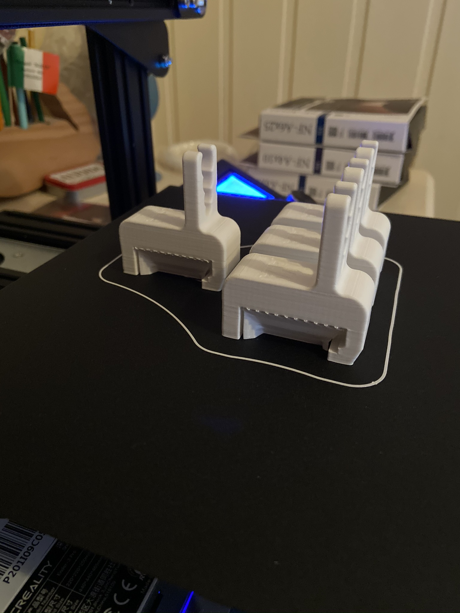
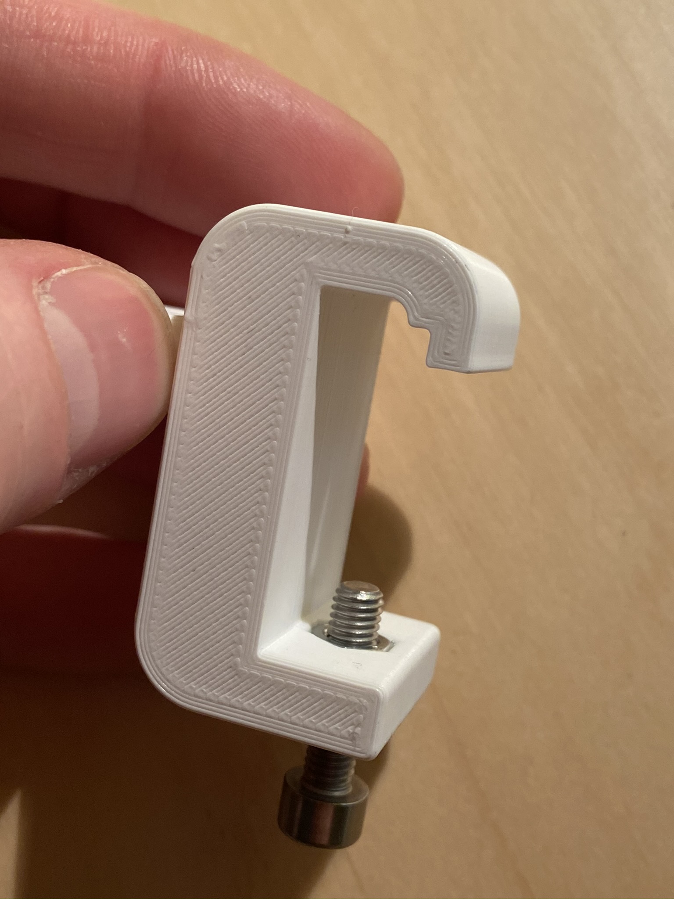

# Description
This is a 3D-printed tubing holder for bed side rails in hospitals. My local hospital is expanding their ICU for COVID-19 patients and needed more holders so I helped them by printing some of these. They have been tested with  10x30mm EU DIN medical equipment rails [like this](http://www.cableflow.com/wp-content/uploads/2014/10/Medical-Rail.pdf), but I'm positive it will work with 10x25mm rails as well, provided your bolt is long enough.

# You will need
 * A 3D printer
 * M5 nut and bolt

# Build Instructions
I print these on my Ender 3 Pro in PLA using Cura. I find conical supports, only touching build plate easiest to remove. After the print is finished, drop in an M5 nut and thread the bold in.

# Pictures
Recommended print orientation

Assembled clamp. (note: this is an earlier prototype)

# Keywords
Medical equipment rail, bed side rail, clamp, hose, tubing, hospital, vacuum, ISO 19054:2006

# License
The Unlicense
